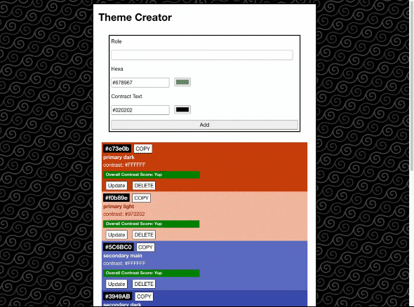
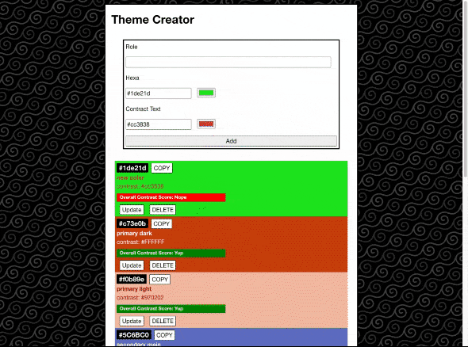
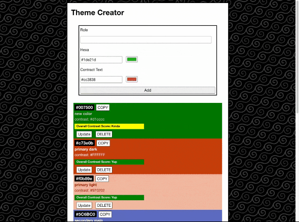

# Color Theme Creator App 🎨

This repository contains the **reference solution** for the Color Theme Creator, a recap project from the Web Development Bootcamp at Spiced Academy.

The project is structured around a **GitHub Project Board** with predefined issues, designed to teach students how to break a feature into smaller tasks and work through them incrementally.

> 📋 The full setup instructions for creating your own version of this project can be found in [INSTRUCTIONS.md](./INSTRUCTIONS.md).

## Purpose

The **Color Theme Creator** is designed to help students consolidate their React knowledge by building a practical, interactive app from scratch. Working through the predefined issues on the project board, students practice:

1. **Breaking down a project**: Using GitHub Issues and a Project Board to plan and track work.
2. **Component-based architecture**: Structuring the app into reusable React components.
3. **State management**: Managing and sharing state across components.
4. **User interaction**: Handling input events and reflecting changes in the UI in real time.
5. **Dynamic styling**: Applying user-defined colors to the UI using React state and inline styles.

## Running the Project

1. Clone the repository.

2. Install dependencies:

    ```bash
      npm install
    ```

3. Start the development server:

    ```bash
      npm run dev
    ```

4. Open [localhost:3000](http://localhost:3000) in your browser.

## Features

* 🎨 Create and customize a color theme
* 🖌️ Live preview of the selected colors applied to the UI
* ➕ Add, update, and remove colors from the theme
* 📋 Organized development workflow via GitHub Issues and Project Board

## Technologies


* **React** — Component-based UI
* **JavaScript** — Application logic
* **CSS** — Styling

## Preview

### New Color



### Update Color



### Delete Color



### Copy Color


